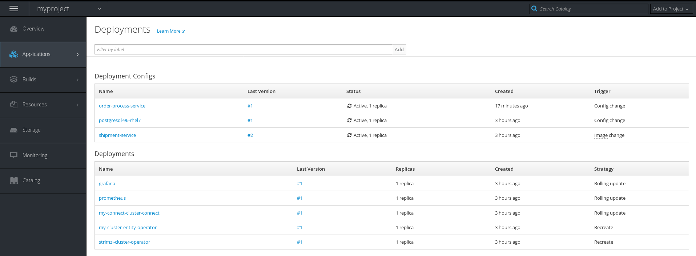
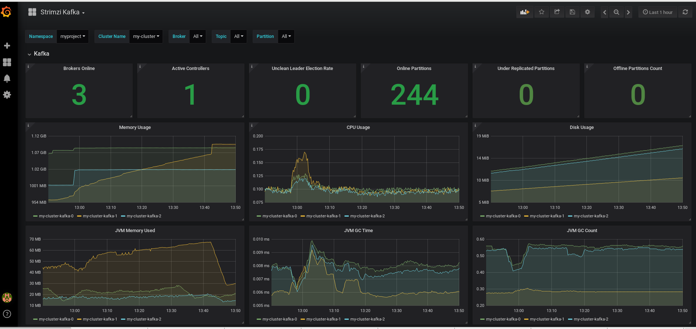

## Order application ##

A sample application showing how to send and receive events to/from kafka.<br>
The application simulates the creation of an Order and a Shipment: <br>
 - an Order contains several OrderItem
 - a Shipment can be created only when all items beloging to an order are READY.

The Order events are sent to a Kafka topic via Order service.<br>
The Order events are received by Order process service and sent to the Shipment service via a Rest call.<br>
The Shipment service aggregates the events and produces a Shipment object. The Shipment object is also saved on DBMS.

### Deploy on OpenShift ###

Required software:

- You need OpenShift 3.11 and a user with cluster-admin role (to deploy the strimzi operators)
- You will run the Apache Kafka (and Zookeeper) cluster on OpenShift using Strmizi:
https://strimzi.io
- You will also deploy on Openshift, Promethes and Grafana to collect and show some kafka metrics
- Shipment service will de deployed on OpenShift using the fabric8 maven plugin
https://maven.fabric8.io/
- Order process service will be deployed on OpenShift using the openjdk18 image for OpenShift
https://registry.access.redhat.com/redhat-openjdk-18/openjdk18-openshift
- Order service will be deployed on OpenShift using the openjdk18 image for OpenShift.<br>
On demand aan OpenShift job will run a scenario with 500 orders.

This is an image showing your final namespace:


- Download strimzi, version 0.10

```
wget https://github.com/strimzi/strimzi-kafka-operator/releases/download/0.10.0/strimzi-0.10.0.tar.gz
tar xvf strimzi-0.10.0.tar.gz
```

- Create an OpenShift project and kafka cluster with 3 brokers (3 zookeeper)

```
oc login -u <user> -p <password>
oc new-project myproject
oc apply -f $STRIMZI_HOME/install/cluster-operator -n myproject
oc apply -f $STRIMZI_HOME/examples/templates/cluster-operator -n myproject
oc apply -f $STRIMZI_HOME/examples/metrics/kafka-metrics.yaml -n myproject
```

- Optional, deploy kafka connect and test a sample producer and a sample consumer

```
oc apply -f $STRIMZI_HOME/examples/kafka-connect/kafka-connect.yaml -n myproject
oc run kafka-producer -ti --image=strimzi/kafka:0.10.0-kafka-2.1.0 --rm=true --restart=Never -- bin/kafka-console-producer.sh --broker-list my-cluster-kafka-bootstrap:9092 --topic my-topic
oc run kafka-consumer -ti --image=strimzi/kafka:0.10.0-kafka-2.1.0 --rm=true --restart=Never -- bin/kafka-console-consumer.sh --bootstrap-server my-cluster-kafka-bootstrap:9092 --topic my-topic --from-beginning
```

- Install strimzi metrics, prometheus and grafana

```
wget https://raw.githubusercontent.com/strimzi/strimzi-kafka-operator/0.10.0/metrics/examples/prometheus/kubernetes.yaml
mv kubernetes.yaml prometheus.yaml
oc apply -f prometheus.yaml -n myproject
wget https://raw.githubusercontent.com/strimzi/strimzi-kafka-operator/0.10.0/metrics/examples/grafana/kubernetes.yaml
mv kubernetes.yaml grafana.yaml
oc apply -f grafana.yaml -n myproject
oc port-forward <name-of-grafana-pod> 3000:3000
```

- Import grafana dashboards

Login to http://localhost:3000 (admin/admin) and follow the steps available at:<br>
https://strimzi.io/docs/latest/#grafana_dashboard

Grafana kafka dashboard:



- Deploy a container for postgres (required by the shipment service)

```
oc import-image my-rhscl/postgresql-96-rhel7 --from=registry.access.redhat.com/rhscl/postgresql-96-rhel7 --confirm -n myproject
oc new-app -e POSTGRESQL_USER=orders -e POSTGRESQL_PASSWORD=orders -e POSTGRESQL_DATABASE=orders postgresql-96-rhel7 -n myproject
```

- Deploy a container for the shipment service (we will use fabric8 maven plugin)

```
cd shipment-service
mvn package fabric8:deploy -Popenshift -DskipTests
```

- Deploy a container for the order process service (we will use source to image build in openshift)

```
cd order-process-service
oc import-image my-redhat-openjdk-18/openjdk18-openshift --from=registry.access.redhat.com/redhat-openjdk-18/openjdk18-openshift --confirm -n myproject
oc new-build --binary --image-stream openjdk18-openshift --name order-process-service
oc start-build order-process-service --from-dir=.
oc new-app order-process-service -e kafka.broker.list=my-cluster-kafka-bootstrap:9092 -e shipment.url=http://shipment-service:8080/shipment
```

- Deploy a container for the order service (we will use source to image build in openshift)

```
cd order-service
oc new-build --binary --image-stream openjdk18-openshift --name order-service
oc start-build order-service --from-dir=.
```

- Run a simulated scenario (send 500 orders)

An OpenShift job invoking the main java class for the Order Service will be created and set of 500 will be delivered.

```
cd order-service/src/main/resources
oc create -f orderservicejob.yml
```
